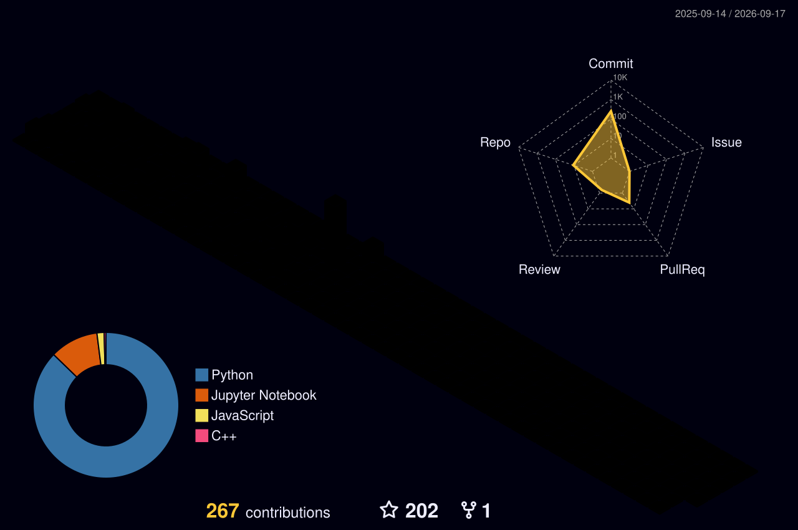
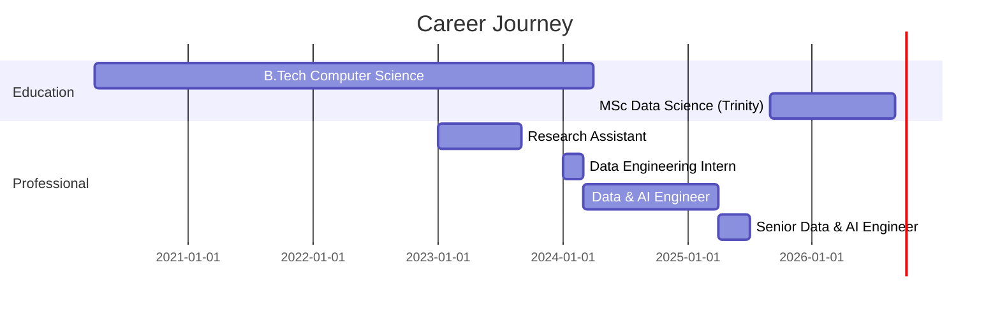

<div align="center">
  
</div>

<div align="center">

[](https://git.io/typing-svg)

</div>

<br>

<div align="center">
  
[](https://visitcount.itsvg.in)

</div>

<br>


<br>

<div align="center">
'''
const hirthick = {
    location: "Dublin, Ireland 🇮🇪",
    role: "Data & AI Engineer",
    company: "JMAN Group → Trinity College Dublin",
    impact: {
        revenue: "$180K shipped",
        scale: "5TB+ daily processing", 
        reliability: "99.9% uptime",
        performance: "40% faster pipelines"
    },
    currently: "Building scalable ML systems",
    openTo: "Data Engineering, ML Engineering, AI roles"
};
console.log("Production systems that actually scale 🚀");
'''
</div>
<br>


<br>

## 🎯 Production Systems

<table>
<tr>
<td width="50%" valign="top">

### 🌍 GraphWiz Ireland
<a href="https://huggingface.co/spaces/hirthickraj2015/graphwiz-ireland">
  
</a>

RAG-powered knowledge engine deployed on HuggingFace Spaces

```yaml
Architecture: RAG + Vector Search
LLM: Groq API (Llama)
Vector DB: FAISS
Framework: LangChain
Deploy: Docker + HuggingFace
Status: ✅ Real-time inference
```

**Impact:** Semantic search with source attribution & auto-scaling

[🔗 Live Demo](https://huggingface.co/spaces/hirthickraj2015/graphwiz-ireland) • [📂 Code](https://github.com/hirthickraj2015/graphwiz-ireland)

---

### 📊 Ireland Housing Market
<a href="https://app.powerbi.com/view?r=eyJrIjoiZDRkMjQxMWYtODc0Zi00YTFjLTlhMmUtODIwZjBmZDE2MmU3IiwidCI6IjJiYTllMWE5LWEwYjktNDMzYy04MGMyLTE5ZWU1NDE3YmVkNyIsImMiOjh9">
  
</a>

Interactive analytics platform for Irish property market

```yaml
Pipeline: Property Price Register API
ETL: Python + Azure Data Factory
Analytics: Power BI + DAX
Features:
  - Price trend analysis
  - Geographic heatmaps
  - Market forecasting
  - Regional comparisons
```

[🔗 View Dashboard](https://app.powerbi.com/view?r=eyJrIjoiZDRkMjQxMWYtODc0Zi00YTFjLTlhMmUtODIwZjBmZDE2MmU3IiwidCI6IjJiYTllMWE5LWEwYjktNDMzYy04MGMyLTE5ZWU1NDE3YmVkNyIsImMiOjh9) • [📂 Code](https://github.com/hirthickraj2015/ireland-housing)

</td>
<td width="50%" valign="top">

### 🎯 Telecom Churn Engine


End-to-end ML pipeline on Databricks with production MLOps

```yaml
Architecture: Medallion (Bronze→Silver→Gold)
ML Stack:
  - Models: LightGBM, XGBoost, Random Forest
  - Features: 50+ engineered
  - Tracking: MLflow experiments
  - Deploy: Automated retraining
Performance:
  - AUC-ROC: 0.89
  - Uptime: 99.5%
  - Processing: Real-time predictions
```

[📂 Repository](https://github.com/hirthickraj2015/telecom-churn)

---

### 🔍 GlassboxML


Explainable AI framework for model interpretability

```yaml
Purpose: Model governance for regulated industries
Methods:
  - SHAP-based analysis
  - Per-prediction breakdowns
  - Audit trail generation
Supported:
  - scikit-learn
  - XGBoost / LightGBM
  - Custom estimators
```

[📂 Repository](https://github.com/hirthickraj2015/glassboxml)

</td>
</tr>
</table>

<br>


<br>

## 💰 Business Impact

<div align="center">

| 💵 Revenue | ⚡ Performance | 🎯 Reliability | 💡 Optimization |
|:----------:|:-------------:|:--------------:|:---------------:|
| **$180K increase** | **40% faster** | **99.9% uptime** | **25% cost cut** |
| LightGBM scoring | PySpark optimization | Production ML | AI automation |
| 85%+ precision | 5TB+ daily data | Real-time inference | Prompt engineering |

</div>

```diff
@@ Production Metrics @@

+ Revenue: $180K increase through ML-driven account prioritization
+ Scale: Enterprise platform supporting $260M company exit
+ Performance: 40% faster processing on 5TB+ daily throughput
+ Reliability: 99.9% uptime for production ML infrastructure
+ Cost: 25% reduction via intelligent automation (90%+ accuracy)
+ Promotion: Fast-tracked to Senior Engineer (Top 1% performer)
```

<br>


<br>

## 🛠️ Tech Arsenal

<div align="center">

### Core Languages


### Machine Learning & AI


### LLMs & GenAI


### Cloud & Infrastructure  


### Data & Analytics


</div>

<br>


<br>

## 📊 GitHub Analytics

<div align="center">
  
</div>

<div align="center">
  
</div>

<br>


<br>

## 🏔️ 3D Contribution Terrain

<div align="center">
  
</div>

<br>


<br>
## 💼 Experience Timeline

<div align="center">



</div>

<details>
<summary><b>🏆 Senior Data & AI Engineer @ JMAN Group (Apr 2025 - Jul 2025)</b></summary>

<br>

**UK-Based Commercial Data Partner for Private Equity**

- 💰 Built ML system generating **$180K revenue increase** using LightGBM for intelligent account prioritization
- 🏢 Architected enterprise data platform on Microsoft Fabric supporting **$260M company exit**
- 🎯 Achieved **85%+ precision** with real-time inference deployment on Azure ML
- ⚡ Optimized data pipelines achieving **40% faster processing** on 5TB+ daily data
- 🔧 Implemented end-to-end ML workflow with SHAP-based interpretability for stakeholder trust

</details>

<details>
<summary><b>🤖 Data & AI Engineer @ JMAN Group (Mar 2024 - Apr 2025)</b></summary>

<br>

- 💡 Engineered AI automation achieving **25% cost reduction** with 90%+ accuracy
- 🚀 Built scalable ML infrastructure on Databricks with MLflow for experiment tracking
- 📈 Developed prompt engineering framework improving accuracy by 15% while reducing API costs by 20%
- 🎯 Maintained **99.9% pipeline reliability** for production ML systems
- 🔗 Designed intelligent data platform supporting disaster management emergency response

</details>

<details>
<summary><b>🔬 Research Assistant @ St Joseph's Institute (Jan 2023 - Sep 2023)</b></summary>

<br>

- 📚 Published IEEE conference paper on AI-powered text analysis using transformer models
- 🧠 Implemented extractive and abstractive summarization with BERT and GPT architectures
- 🔧 Developed NLP systems using TensorFlow for text classification and generation
- 📊 Conducted extensive experimentation with neural architectures and evaluation metrics (ROUGE, BLEU)

</details>

<br>


<br>

## 🎓 Education & Credentials

<table>
<tr>
<td width="50%">

### 🏛️ Trinity College Dublin 🇮🇪
**MSc in Data Science**  
*Sep 2025 - Present*

**Focus Areas:**
- Artificial Intelligence
- Machine Learning & Deep Learning
- Computer Vision & NLP
- Scalable Computing

</td>
<td width="50%">

### 🏛️ St Joseph's Institute of Technology 🇮🇳
**B.Tech Computer Science**  
*Apr 2020 - Apr 2024*

**First Class Honours**

**Specializations:**
- Machine Learning
- Data Structures & Algorithms
- Cloud Computing

</td>
</tr>
</table>

### 🏅 Certifications

<div align="center">


</div>

### 🏆 Achievements

- 🌟 **Top 1% Performer** - Fast-tracked to Senior Data & AI Engineer
- 📝 **IEEE Published Researcher** - AI-Powered Text Analysis (2023)
- 🚀 **Production Impact** - Shipped systems driving $180K revenue
- ✍️ **Technical Writer** - Publishing ML engineering insights on Medium

<br>


<br>

## 🤝 Connect & Collaborate

<div align="center">

[](https://linkedin.com/in/hirthick-raj)
[](https://github.com/hirthickraj2015)
[](mailto:dheenadh@tcd.ie)
[](https://github.com/hirthickraj2015)

</div>

<div align="center">

### 💭 Open To

Building production ML systems • Data infrastructure at scale • LLM integration projects  
Interested in Data Engineering, ML Engineering, and AI roles

</div>

<br>

<div align="center">
  
</div>

<div align="center">


**⭐ Star my repos if you find them interesting!**

</div>
